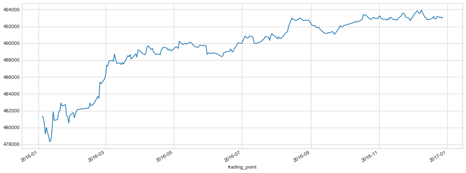
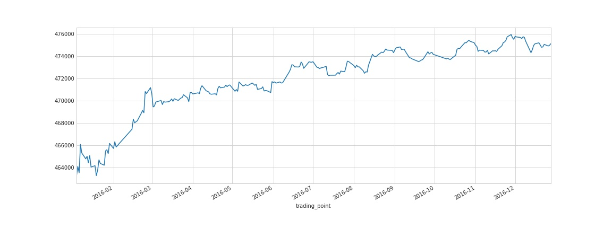
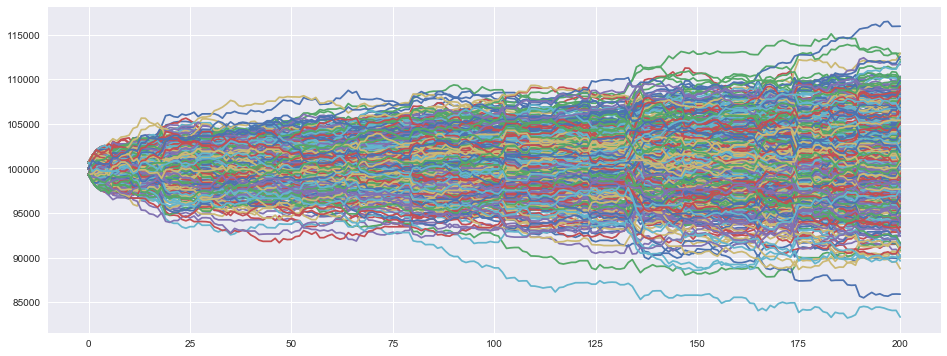

*2018-01-05*

重构了一下DQN期货则时，样本外效果还不错，胜率: 0.537190082645/ 0.5413223140495868。日频交易，股指期货策略，单纯判断方向信号

假期突击入门增强学习(reinforcement learning)，简单构建了一个简单的运算框架加深对RL的理解。

指数择时的外部Environment 简单的使用日线HS300指数bar数据，在每交易日使用开盘价响应Agent的行为（沽空、沽多和空仓），使用收盘价+账户现金存余为当日账户总值。

下图为Agent使用完全探索策略运行5000次，账户总值走势。

不同于此前博客介绍的RNN用于股票的预测，RL在每个state（或帧）预测的是折扣未来预期收益（此处可以理解为远期标折现）。对比RNN模型，RL模型在对股票市场未来走势的预测方面更加宽松或更鲁棒。RL在$s_t$产生的预测由未来预期收益由真实奖励$R_t$ 和逼近函数模型估计未来一段时间折扣收益组成。这相比于RNN更加宽松，因为我们不能期望股票市场的模式或者状态与未来股价走势存在严格的函数关系，也就是不应该期望在$t$ 时刻的事件精准的反馈在$t+k$ 时刻的股价上面。此外通常在实际使用RL模型的时候不需要特别精确的收敛，通常只要达到一定的准确程度或一定的收敛范围即可。

RL在状态state($s_t$) 预测是庞大但有限预期收益折现值。

$predict_t= G_t \doteq \sum_{k=0}^{\infty} \gamma^k R_{t+k+1}\\=R_t+ \sum_{k=1}^{\infty} \gamma^k R_{t+k+1} $

RNN在状态$s_t$ 预测的是未来某个节点或者节点很小波动范围内的预期收益。

$predict_t= R_{t+k} + Var(R_{t+k}) $

然而针对决策过程设计的RL系统，大多数强制假设马尔可夫决策过程(Markov Decision Processes)，当然这在工程应用中具有极好的效果，通常非马尔科夫属性的决策过程也可以通过MDP有效的近似。然而不同于工业应用场景，虚拟交易员(Agent)在A股市场面对的是一个动态变化的环境，不同于前面的工业应用，A股市场Environment 的规则是动态变动的，并且这种变动通常无法从盘面数据预测。此外，RL系统一般可以通过选择action来控制或影响情景发展，如AlphaGo、DQN等在围棋、游戏上面的动作可以切实影响RL决策系统未来接受的state， 但是Agent的行为难以影响A股市场，或无法捕捉这种行为影响。也就是，Agent对action的决策只能影响到未来获得奖励，而无法对交互环境产生影响。

Agent for game

$action \to reward\ and \ next\ state$

Agent for A股

$action \to reward$

