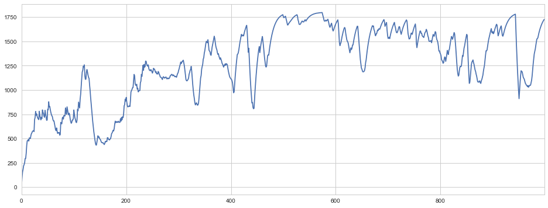

# Advantage Actor-Critic

A2C

##### forward

common network = swich(linear(state))

policy = softmax(linear(common network))

value = linear(common network)

##### loss

policy_loss = log(stochastic(policy)) * advantage

entropy_loss = $\sum$ policy * log(policy)

value_loss = mse(advantage)

advantage = R - V =r + $\gamma$ V' - V

##### train

repeat MAX_EPISODES:

- actor optimizer
- critic optimizer

