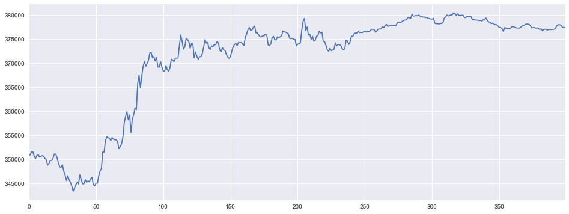

## 虚拟交易员HS300指数择时-使用A3C训练卷积网络逼近函数

对*Note-6.2 A3C与HS300指数择时* 代码简述

使用asynchronous advantage actor-critic 框架优化两个神经网络近似函数，训练一个虚拟的指数择时交易员。

*A3C* 的计算框架简单说就是多个*AC* （Actor-Critic）同步进行工作，并且每个一段时间交流一下修正方向。简单的使用一个课题组进行比喻，设某课题有导师一人，学生N人，对一项课题进行研究。每周学生找导师交流一次，或每次学生卡壳找导师交流一次。这样所有的探索经验都会上传到导师处，导师综合所有的探索，同时了解多方向的进展和问题，修正课题组研究路线。学生获得导师的经验，可以从导师处获得技巧或者杀招，加速自己这一周研究进程。

具体到代码，优化器放在Access中，在每t_max时间步后N个Worker探索获得梯度上传到Access中通过优化器更新Access中神经网络逼近函数的权重，并将Access中使用梯度修正的权重取回初始化本地的Worker神经网络权重。所有的可训练变量全部定义在Trainable Net中。

###### forward network

actor network

- conv swich
- conv swich
- linear swich
- linear num_action

critic network

- conv swich
- conv swich
- linear swich
- linear 1

注由于估值函数误差较大，这里选择使用两个训练网络

-----

出于简单考虑，这里假设指数交易训练是马尔可夫决策过程，并且使用有限的市场行情回溯窗口。

具体，交易员训练环境设计为：Environment 简单的使用日线HS300指数bar数据，在每交易日交易员发出交易指令，如沽空，environment 使用当日开盘价做空，使用当日收盘价评价这次交易行为的价值， 使用收盘价+账户现金存余-当日交易摩擦成本为当日账户总值。

对于虚拟交易员（Agent）使用32交易日reward折现值为target进行优化。

-----

虚拟交易员样本外交易账户净值走势

